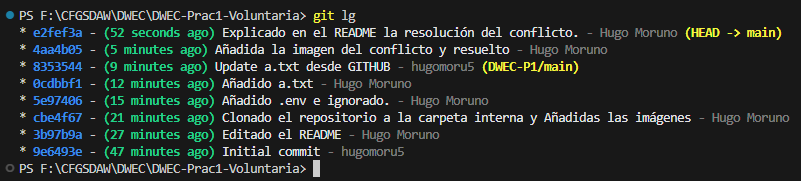

# DWEC-Prac1-Voluntaria

## Clonación del Proyecto en la carpeta temp

### Comando y ventana de confirmación

### Ejecución

## Conflicto provocado en el repositorio en linea

El conflicto se ha solucionado mediante el asistente de código de VSCode.
Una vez resuelto se ha cerrado la incidencia con el comando: __git rebase --continue__

## Conflicto provocado (Resuelto de forma correcta)

El conflicto se ha resuelto haciendo un Merge con el DETACHED_HEAD y el commit local.

## Línea del tiempo generada por git

Se ha usado el comando:  
__git log --graph --abbrev-commit --decorate --format=format:'%C(bold blue)%h%C(reset) - %C(bold green)(%ar)%C(reset) %C(white)%s%C(reset) %C(dim white)- %an%C(reset)%C(bold yellow)%d%C(reset)' --all__

