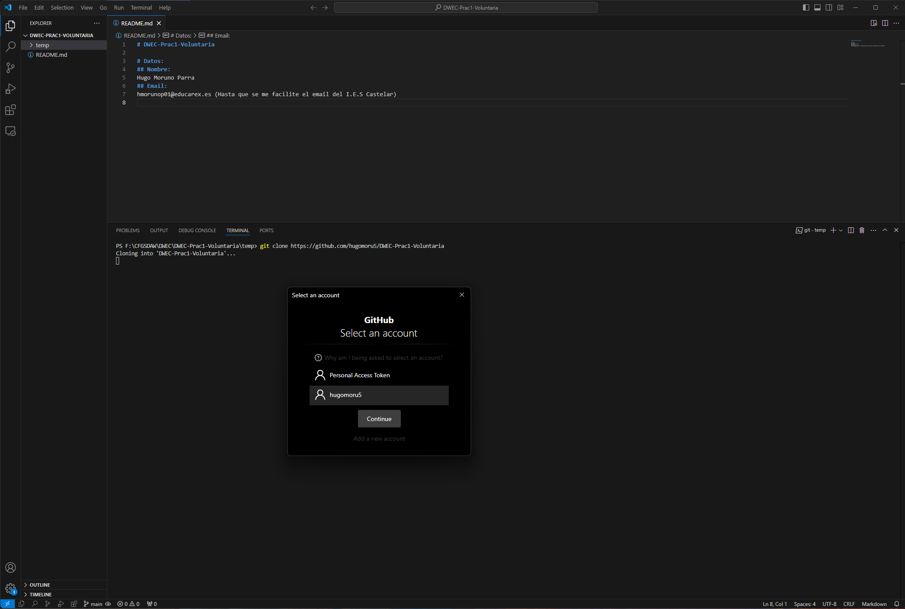
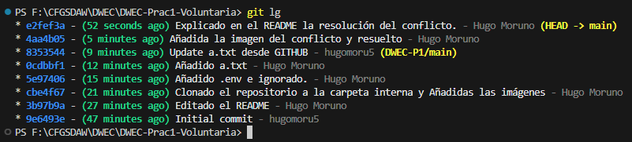

# DWEC-Prac1-Voluntaria

# Datos:
## Nombre:
Hugo Moruno Parra
## Email: 
hmorunop01@educarex.es (Hasta que se me facilite el email del I.E.S Castelar)

# Clonación del Proyecto en la carpeta temp.

## Comando y ventana de confirmación:

## Ejecución:

# Conflicto provocado en el repositorio en linea

## Imagen:

El conflicto se ha solucionado mediante el asistente de código de VSCode.
Una vez resuelto se ha cerrado la incidencia con el comando: __git rebase --continue__

# Línea del tiempo generada por git:
###### Se ha usado el comando: 
**git log --graph --abbrev-commit --decorate --format=format:'%C(bold blue)%h%C(reset) - %C(bold green)(%ar)%C(reset) %C(white)%s%C(reset) %C(dim white)- %an%C(reset)%C(bold yellow)%d%C(reset)' --all**

